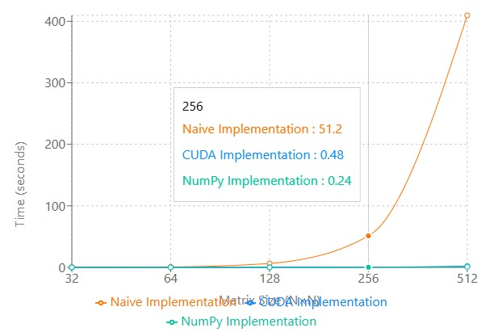
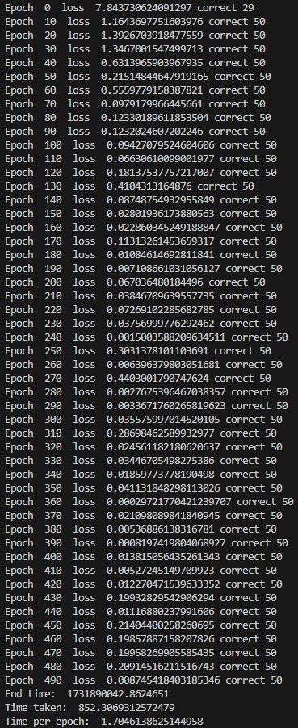
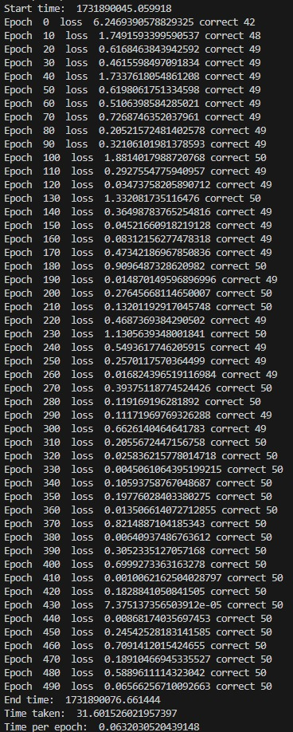
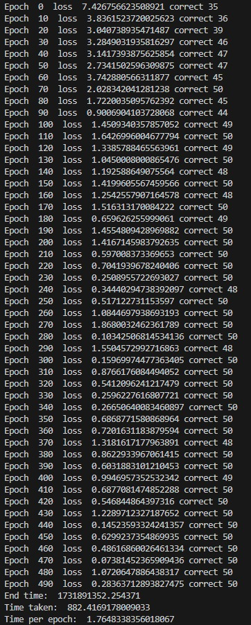
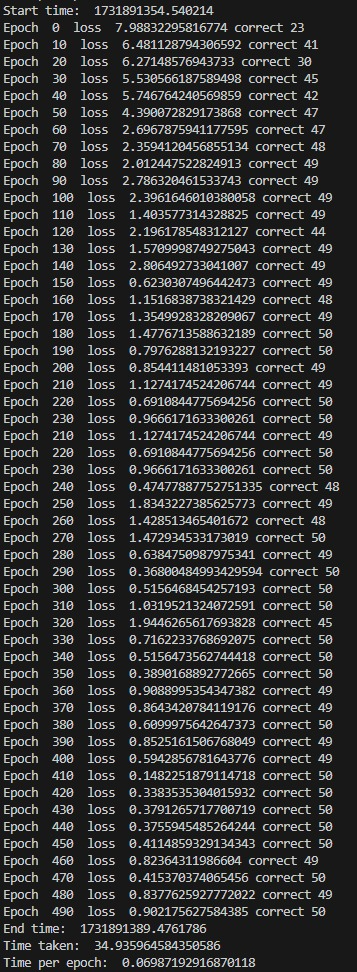
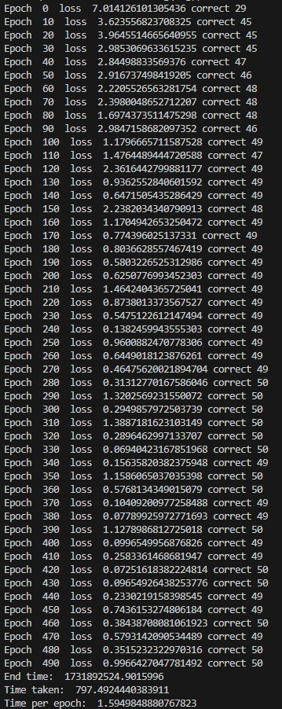
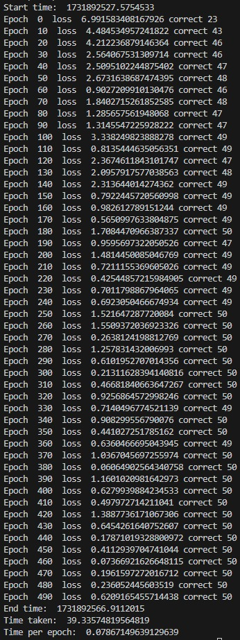
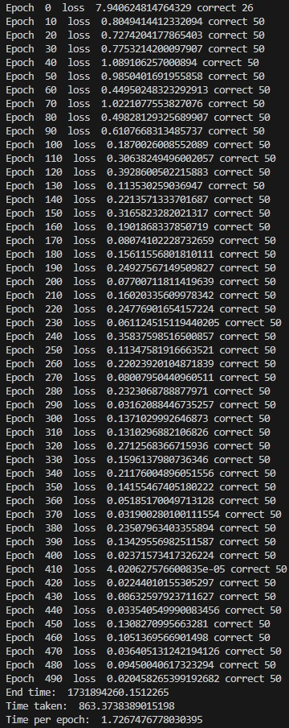
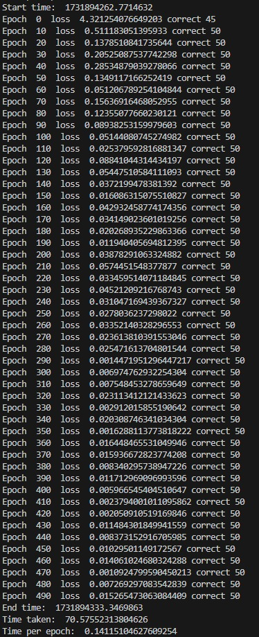

# MiniTorch Module 3


* Docs: https://minitorch.github.io/

* Overview: https://minitorch.github.io/module3.html

## Part 3.4 Graph



Above is a graph (Time in seconds vs Matrix Size NxN) comparing the naive implementation prior to matrix multiplication against the new code created in module 3.4 for matrix multiplication. For context, the numpy matrix multiplication is shown here as well, which is fully optimized beyond our efforts here in module 3.4. However, clearly the work done in this module drastically speeds up computation, as naive vs cuda diverge wildly from the beginning. For additional context, a point is included as reference for matrix size of 256x256, where the naive implementation is over 100x slower than the CUDA implementation, but still lacking from numpy's matrix multiplication by about a factor of 2.

## Part 3.5 Logs

### [Simple]

### GPU Log & CPU Log



### [Split]

### GPU Log & CPU Log



### [XOR]

### GPU Log & CPU Log



### [Simple Large (Hidden=200)]

### GPU Log & CPU Log



## Parallel Check Optimization
```
MAP

================================================================================
 Parallel Accelerator Optimizing:  Function tensor_map.<locals>._map,
C:\Users\Assaf\VSC\mod3-aworld1\minitorch\fast_ops.py (145)
================================================================================


Parallel loop listing for  Function tensor_map.<locals>._map, C:\Users\Assaf\VSC\mod3-aworld1\minitorch\fast_ops.py (145)
-----------------------------------------------------------------------------------------------|loop #ID
    def _map(                                                                                  |
        out: Storage,                                                                          |
        out_shape: Shape,                                                                      |
        out_strides: Strides,                                                                  |
        in_storage: Storage,                                                                   |
        in_shape: Shape,                                                                       |
        in_strides: Strides,                                                                   |
    ) -> None:                                                                                 |
        size = 1                                                                               |
        for i in range(len(out_shape)):                                                        |
            size *= out_shape[i]                                                               |
                                                                                               |
        # Main parallel loop                                                                   |
        for i in prange(size):-----------------------------------------------------------------| #0
            # Calculate output index                                                           |
            out_index = np.empty(MAX_DIMS, np.int32)                                           |
            to_index(i, out_shape, out_index)                                                  |
                                                                                               |
            # Calculate input index - here's where we need to handle broadcasting correctly    |
            in_index = np.empty(MAX_DIMS, np.int32)                                            |
            broadcast_index(out_index, out_shape, in_shape, in_index)                          |
                                                                                               |
            # Get positions                                                                    |
            out_pos = index_to_position(out_index, out_strides)                                |
            in_pos = index_to_position(in_index, in_strides)                                   |
                                                                                                |
            # Apply function                                                                   |
            out[out_pos] = fn(in_storage[in_pos])                                              |
--------------------------------- Fusing loops ---------------------------------
Attempting fusion of parallel loops (combines loops with similar properties)...
Following the attempted fusion of parallel for-loops there are 1 parallel for-
loop(s) (originating from loops labelled: #0).
--------------------------------------------------------------------------------
----------------------------- Before Optimisation ------------------------------
--------------------------------------------------------------------------------
------------------------------ After Optimisation ------------------------------
Parallel structure is already optimal.
--------------------------------------------------------------------------------
--------------------------------------------------------------------------------

---------------------------Loop invariant code motion---------------------------
Allocation hoisting:
The memory allocation derived from the instruction at
C:\Users\Assaf\VSC\mod3-aworld1\minitorch\fast_ops.py (160) is hoisted out of
the parallel loop labelled #0 (it will be performed before the loop is executed
and reused inside the loop):
   Allocation:: out_index = np.empty(MAX_DIMS, np.int32)
    - numpy.empty() is used for the allocation.
The memory allocation derived from the instruction at
C:\Users\Assaf\VSC\mod3-aworld1\minitorch\fast_ops.py (164) is hoisted out of
the parallel loop labelled #0 (it will be performed before the loop is executed
and reused inside the loop):
   Allocation:: in_index = np.empty(MAX_DIMS, np.int32)
    - numpy.empty() is used for the allocation.
None
ZIP

================================================================================
 Parallel Accelerator Optimizing:  Function tensor_zip.<locals>._zip,
C:\Users\Assaf\VSC\mod3-aworld1\minitorch\fast_ops.py (181)
================================================================================


Parallel loop listing for  Function tensor_zip.<locals>._zip, C:\Users\Assaf\VSC\mod3-aworld1\minitorch\fast_ops.py (181)
-----------------------------------------------------------------------|loop #ID
    def _zip(                                                          |
        out: Storage,                                                  |
        out_shape: Shape,                                              |
        out_strides: Strides,                                          |
        a_storage: Storage,                                            |
        a_shape: Shape,                                                |
        a_strides: Strides,                                            |
        b_storage: Storage,                                            |
        b_shape: Shape,                                                |
        b_strides: Strides,                                            |
    ) -> None:                                                         |
        size = 1                                                       |
        for i in range(len(out_shape)):                                |
            size *= out_shape[i]                                       |
                                                                       |
        # Main parallel loop                                           |
        for i in prange(size):-----------------------------------------| #1
            out_index = np.empty(MAX_DIMS, np.int32)                   |
            to_index(i, out_shape, out_index)                          |
                                                                       |
            # Handle broadcasting for both inputs                      |
            a_index = np.empty(MAX_DIMS, np.int32)                     |
            b_index = np.empty(MAX_DIMS, np.int32)                     |
            broadcast_index(out_index, out_shape, a_shape, a_index)    |
            broadcast_index(out_index, out_shape, b_shape, b_index)    |
                                                                       |
            # Get positions                                            |
            out_pos = index_to_position(out_index, out_strides)        |
            a_pos = index_to_position(a_index, a_strides)              |
            b_pos = index_to_position(b_index, b_strides)              |
                                                                       |
            # Apply function                                           |
            out[out_pos] = fn(a_storage[a_pos], b_storage[b_pos])      |
--------------------------------- Fusing loops ---------------------------------
Attempting fusion of parallel loops (combines loops with similar properties)...
Following the attempted fusion of parallel for-loops there are 1 parallel for-
loop(s) (originating from loops labelled: #1).
--------------------------------------------------------------------------------
----------------------------- Before Optimisation ------------------------------
--------------------------------------------------------------------------------
------------------------------ After Optimisation ------------------------------
Parallel structure is already optimal.
--------------------------------------------------------------------------------
--------------------------------------------------------------------------------

---------------------------Loop invariant code motion---------------------------
Allocation hoisting:
The memory allocation derived from the instruction at
C:\Users\Assaf\VSC\mod3-aworld1\minitorch\fast_ops.py (202) is hoisted out of
the parallel loop labelled #1 (it will be performed before the loop is executed
and reused inside the loop):
   Allocation:: a_index = np.empty(MAX_DIMS, np.int32)
    - numpy.empty() is used for the allocation.
The memory allocation derived from the instruction at
C:\Users\Assaf\VSC\mod3-aworld1\minitorch\fast_ops.py (203) is hoisted out of
the parallel loop labelled #1 (it will be performed before the loop is executed
and reused inside the loop):
   Allocation:: b_index = np.empty(MAX_DIMS, np.int32)
    - numpy.empty() is used for the allocation.
The memory allocation derived from the instruction at
C:\Users\Assaf\VSC\mod3-aworld1\minitorch\fast_ops.py (198) is hoisted out of
the parallel loop labelled #1 (it will be performed before the loop is executed
and reused inside the loop):
   Allocation:: out_index = np.empty(MAX_DIMS, np.int32)
    - numpy.empty() is used for the allocation.
None
REDUCE

================================================================================
 Parallel Accelerator Optimizing:  Function tensor_reduce.<locals>._reduce,
C:\Users\Assaf\VSC\mod3-aworld1\minitorch\fast_ops.py (221)
================================================================================


Parallel loop listing for  Function tensor_reduce.<locals>._reduce, C:\Users\Assaf\VSC\mod3-aworld1\minitorch\fast_ops.py (221)
----------------------------------------------------------------------|loop #ID
    def _reduce(                                                      |
        out: Storage,                                                 |
        out_shape: Shape,                                             |
        out_strides: Strides,                                         |
        a_storage: Storage,                                           |
        a_shape: Shape,                                               |
        a_strides: Strides,                                           |
        reduce_dim: int,                                              |
    ) -> None:                                                        |
        size = 1                                                      |
        for i in range(len(out_shape)):                               |
            size *= out_shape[i]                                      |
        reduce_size = a_shape[reduce_dim]                             |
                                                                      |
        for i in prange(size):----------------------------------------| #2
            # Get output index                                        |
            out_index = np.empty(MAX_DIMS, np.int32)                  |
            to_index(i, out_shape, out_index)                         |
            out_pos = index_to_position(out_index, out_strides)       |
                                                                      |
            # Set up input index                                      |
            a_index = np.empty(MAX_DIMS, np.int32)                    |
            for j in range(len(out_shape)):                           |
                a_index[j] = out_index[j]                             |
                                                                      |
            # First value                                             |
            a_index[reduce_dim] = 0                                   |
            acc = a_storage[index_to_position(a_index, a_strides)]    |
                                                                      |
            # Reduce remaining values                                 |
            for j in range(1, reduce_size):                           |
                a_index[reduce_dim] = j                               |
                a_pos = index_to_position(a_index, a_strides)         |
                acc = fn(acc, a_storage[a_pos])                       |
                                                                      |
            out[out_pos] = acc                                        |
--------------------------------- Fusing loops ---------------------------------
Attempting fusion of parallel loops (combines loops with similar properties)...
Following the attempted fusion of parallel for-loops there are 1 parallel for-
loop(s) (originating from loops labelled: #2).
--------------------------------------------------------------------------------
----------------------------- Before Optimisation ------------------------------
--------------------------------------------------------------------------------
------------------------------ After Optimisation ------------------------------
Parallel structure is already optimal.
--------------------------------------------------------------------------------
--------------------------------------------------------------------------------

---------------------------Loop invariant code motion---------------------------
Allocation hoisting:
The memory allocation derived from the instruction at
C:\Users\Assaf\VSC\mod3-aworld1\minitorch\fast_ops.py (242) is hoisted out of
the parallel loop labelled #2 (it will be performed before the loop is executed
and reused inside the loop):
   Allocation:: a_index = np.empty(MAX_DIMS, np.int32)
    - numpy.empty() is used for the allocation.
The memory allocation derived from the instruction at
C:\Users\Assaf\VSC\mod3-aworld1\minitorch\fast_ops.py (237) is hoisted out of
the parallel loop labelled #2 (it will be performed before the loop is executed
and reused inside the loop):
   Allocation:: out_index = np.empty(MAX_DIMS, np.int32)
    - numpy.empty() is used for the allocation.
None
MATRIX MULTIPLY

================================================================================
 Parallel Accelerator Optimizing:  Function _tensor_matrix_multiply,
C:\Users\Assaf\VSC\mod3-aworld1\minitorch\fast_ops.py (261)
================================================================================


Parallel loop listing for  Function _tensor_matrix_multiply, C:\Users\Assaf\VSC\mod3-aworld1\minitorch\fast_ops.py (261)
----------------------------------------------------------------------|loop #ID
def _tensor_matrix_multiply(                                          |
    out: Storage,                                                     |
    out_shape: Shape,                                                 |
    out_strides: Strides,                                             |
    a_storage: Storage,                                               |
    a_shape: Shape,                                                   |
    a_strides: Strides,                                               |
    b_storage: Storage,                                               |
    b_shape: Shape,                                                   |
    b_strides: Strides,                                               |
) -> None:                                                            |
    # Get dimensions                                                  |
    n_batches = np.int32(np.maximum(a_shape[0], b_shape[0]))          |
    n_rows = a_shape[1]                                               |
    n_cols = b_shape[2]                                               |
    n_inner = a_shape[2]                                              |
                                                                      |
    # Get batch strides, handling broadcasting                        |
    a_batch_stride = a_strides[0] if a_shape[0] > 1 else 0            |
    b_batch_stride = b_strides[0] if b_shape[0] > 1 else 0            |
                                                                      |
    # Parallel loop over batches                                      |
    for batch in prange(n_batches):-----------------------------------| #3
        for i in range(n_rows):                                       |
            for j in range(n_cols):                                   |
                acc = 0.0                                             |
                                                                      |
                # Calculate base positions for this output element    |
                out_pos = (batch * out_strides[0] +                   |
                          i * out_strides[1] +                        |
                          j * out_strides[2])                         |
                a_base = batch * a_batch_stride + i * a_strides[1]    |
                b_base = batch * b_batch_stride + j * b_strides[2]    |
                                                                      |
                # Inner product                                       |
                for k in range(n_inner):                              |
                    a_pos = a_base + k * a_strides[2]                 |
                    b_pos = b_base + k * b_strides[1]                 |
                    acc += a_storage[a_pos] * b_storage[b_pos]        |
                                                                      |
                out[out_pos] = acc                                    |
--------------------------------- Fusing loops ---------------------------------
Attempting fusion of parallel loops (combines loops with similar properties)...
Following the attempted fusion of parallel for-loops there are 1 parallel for-
loop(s) (originating from loops labelled: #3).
--------------------------------------------------------------------------------
----------------------------- Before Optimisation ------------------------------
--------------------------------------------------------------------------------
------------------------------ After Optimisation ------------------------------
Parallel structure is already optimal.
--------------------------------------------------------------------------------
--------------------------------------------------------------------------------

---------------------------Loop invariant code motion---------------------------
Allocation hoisting:
No allocation hoisting found
None
```

You will need to modify `tensor_functions.py` slightly in this assignment.

* Tests:

```
python run_tests.py
```

* Note:

Several of the tests for this assignment will only run if you are on a GPU machine and will not
run on github's test infrastructure. Please follow the instructions to setup up a colab machine
to run these tests.

This assignment requires the following files from the previous assignments. You can get these by running

```bash
python sync_previous_module.py previous-module-dir current-module-dir
```

The files that will be synced are:

        minitorch/tensor_data.py minitorch/tensor_functions.py minitorch/tensor_ops.py minitorch/operators.py minitorch/scalar.py minitorch/scalar_functions.py minitorch/module.py minitorch/autodiff.py minitorch/module.py project/run_manual.py project/run_scalar.py project/run_tensor.py minitorch/operators.py minitorch/module.py minitorch/autodiff.py minitorch/tensor.py minitorch/datasets.py minitorch/testing.py minitorch/optim.py